# Cron No Basta

Cuando tenemos un flujo complejo no nos sirve Cron.

```
# Esto sirve para algo sencillo
* * * 3 30 /shared/scripts/load_data.sh
```

¿Qué ocurre cuando tenemos varios procesos que dependen uno de otro?

```
# Esto sirve para algo sencillo
0 3 * * * /shared/scripts/load_data.sh
0 4 * * * /shared/scripts/drop_indexes.sh
10 4 * * * /shared/scripts/insert_dimensions.sh
30 4 * * * /shared/scripts/insert_facts.sh
30 5 * * * /shared/scripts/create_indexes.sh
```



```mermaid
gantt
    title Cron Schedule Timeline (15 min duration per task)
    dateFormat  HH:mm
    axisFormat %H:%M
    section Daily ETL
    load_data.sh        : 03:00, 15m
    drop_indexes.sh     : 04:00, 15m
    insert_dimensions.sh: 04:10, 15m
    insert_facts.sh     : 04:30, 15m
    create_indexes.sh   : 05:30, 15m
```

Ejemplos de cosas que pueden ir mal:

- Saturación en una línea
- Saturación de un elemento compartido (firewall)
- Locking en la base de datos
- Cuotas de API sobrepasadas
- Cloud Outage
- Que las tareas se solapen entre ellas
