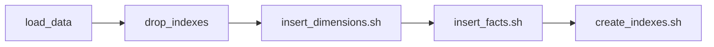

# Happy Path

Estamos acostumbrados a que los procesos se describan con el "happy path".

¿Qué pasa si va todo bien?

Cuando esto es un proceso de negocio **tenemos** que pensar en el que las cosas se van a romper.

¿Cómo nos defendemos ante esto? (y conseguimos de paso que no nos echen)
