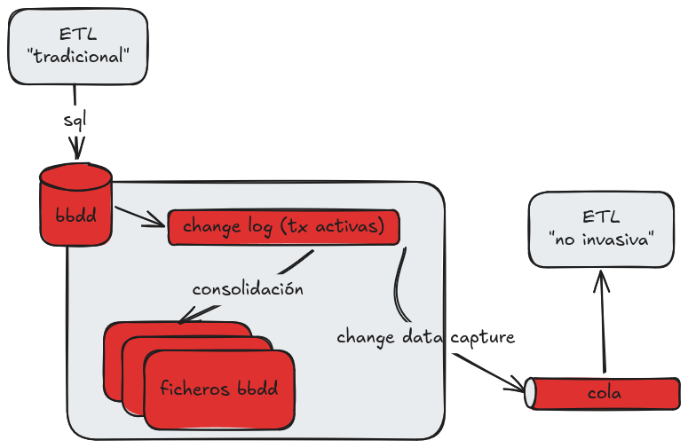

# Ingeniería ETL: No interferencia

El principio de *NO INTERFERENCIA* es fundamental en el proceso de ETL.

Las ETL trabajan con datos que vienen de sus sistemas originales (transaccionales).
Durante la extracción, no se debe interferir en el funcionamiento de estos sistemas.

**LOS SISTEMAS TRANSACCIONALES** sostienen el funcionamiento de la empresa.

En el caso de ETL inversa, se debe adaptar la carga para que los datos que se sincronizar en el transaccional sean consistentes con los datos en el data warehouse o en los maestros de datos.

## Change data capture

Algunas bases de datos permiten la leer del log de transacciones en vez de hacer consultas SQL a la base de datos.
Esto se llama **Change data capture (CDC)**.

El el fichero de transacciones de la base de datos se almacenan las operaciones que se realizan en las tablas.
Cuando se hace un *commit*, se envía esa transacción al fichero de la base de datos.
Esta consolidación se hace periódicamente para maximizar el rendimiento de la base de datos (recuerda: las BBDD están limitadas por la memoria y por E/S, no por CPU) por lo que la base de datos leerá parte de ese fichero de transacciones al hacer consultas.

La ventaja de utilizar CDC es que es mucho más ligero que las consultas SQL a la base de datos.
Si tenemos que transferir mucha información, o es necesario tener una réplica en tiempo real / near real tieme, el CDC es una opción viable porque no carga la base de datos.

Si nuestra BBDD está en la nube, algunos hyperscalers ofrecen CDC como un servicio adicional.

## Limitaciones del CDC

La principal limitación del CDC es que no siempre es viable.
Algunos fabricantes de BBDD no soportan CDC nativamente, o bien requieren licenciamiento adicional.
Por ejemplo, Oracle necesita una licencia de Cluster para utilizar CDC.

Además, para hacer CDC tenemos que incluir un software adicional (como Debezium) que entienda el formato del log de transacciones y nos envíe los cambios a medida que se realizan transacciones.
También necesitaremos una cola de mensajes (como Kafka, MQ, etc..) para almacenar los cambios y enviarlos a destino.

Otra limitación es que los cambios que se capturan se limitan a tablas individuales.
Si utilizamos vistas con joins, o vistas materializadas, el CDC no detectará cambios en los datos.
Estos cambios en los datos los tendremos que adaptar a la estructura que queramos en destino.
Esto nos va a obligar a rehacer la ETL cuando haya algún cambio en la estructura de la base de datos.
