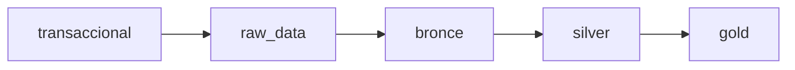

# Ingeniería ETL: Estrategia

Para hacer y orquestar una ETL tenemos que desarrollar una estrategia.

## Minima disrupción

Tenemos que tener en cuenta que vamos a manipular sistemas transaccionales.

Cuando tocamos un transaccional para algo que no es su uso principal, tenemos que **evitar** que se degrade.

Las ETLs son importantes, pero si se paran o no se ejecutan bien una vez, las consecuencias no son graves.

Un tansaccional parado afecta a toda la organización.

No basta con hacer una extracción de datos lo más rápida posible.

Por regla general ***cuanto más tardes en hacer la extracción de datos, más posibilidades hay de que algo EXTERNO falle *** y tu proceso caíga en cascada **pero esa posibilidad no es frecuente**.

La extracción puede ser más lenta, si garantizamos la integridad de toda la infraestructura que hay alrededor de los sistemas.

## Divide y vencerás

Los procesos de negocio son **COMPLEJOS** y, a medida que pasa el tiempo y las organizaciones evolucionan, los procesos de negocio se vuelven todavía más complejos.

La única arma que tenemos contra la complejidad es **simplificar**

Una ETL no es un proceso atómico, una transacción.

Tenemos que construir la ETL usando pasos, lo más independientes posible los unos de otros.

Esto permite "contener" lo que puede ocurrir mal.

Y permite ejecutar paso a paso la ETL, o reiniciarla desde el punto en el que falló sin tener que ejecutar todo de nuevo.

## Utiliza capas

Una técnica de "divide y vencerás" es utilizar capas.

El dato vive en una capa transaccional que no es nuestra: lo primero que tenemos que hacer es sacarlo de ahí con seguridad.

Una vez ingestada la información en una capa "raw" somos independientes de la capa transaccional.

Como mínimo utiliza una capa "raw" para hacer las ETLs.

## Identifica riesgos

Identificar riesgos anticipa problemas, y posibles soluciones.

- Asegurate de que conoces las dependencias de los datos y sistemas que va a atravesar al ETL.
- Si usas la nube, anticipa la posibilidad de un *outage*
- Cuando algo ocurra, no puedes respoder "no lo sé": tienes que tener un plan para que todo siga funcionando.

Tened **MUCHO CUIDADO CON LOS SLAs / OLAs**:
- Cuando hay un SLA, hay que saber claro cuándo aplica (¿los fines de semana también?)
- Los SLAs obligan a tener recursos disponibles para cumplirlos
