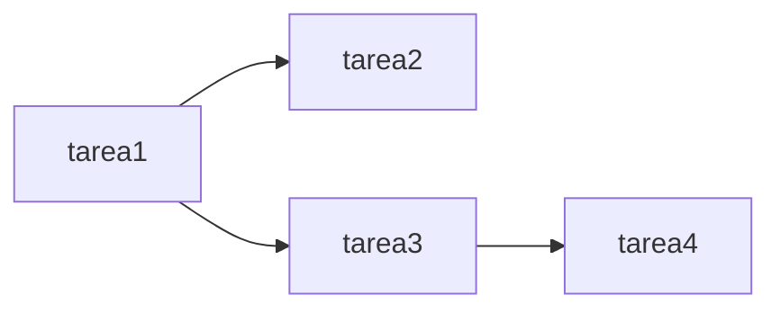
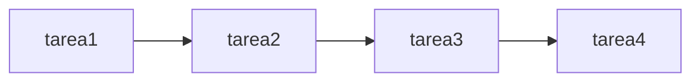

# Nuestro primer DAG

Conceptos fundamentales de airflow:

- **Operadores**: Clases que definen qué trabajo se ejecutará. Por ejemplo PythonOperator (ejecuta código Python), BashOperator (ejecuta comandos bash), o EmailOperator (envía emails).
 
Cada operador representa una unidad de trabajo en tu DAG.

- **Sensores**: Un tipo especial de operador que espera a que se cumpla una condición específica. Por ejemplo, FileSensor espera a que exista un archivo, S3KeySensor espera a que exista un objeto en S3, o HttpSensor espera a que un endpoint esté disponible.
 
Los sensores se ejecutan en un loop hasta que detectan que la condición se cumple.

## Ejemplo: What's my IP Address

Ahora vamos a crear un DAG completo que se conecta al webservice de IP y guarda el resultado:

```python
from airflow import DAG
from airflow.operators.python import PythonOperator
from datetime import datetime, timedelta
from loguru import logger
import requests
import json
import os

# Configuración por defecto del DAG
default_args = {
    'depends_on_past': False,
    'start_date': datetime(2024, 1, 1),
    'retries': 1,
    'retry_delay': timedelta(minutes=5),
}

# Crear el DAG
dag = DAG(
    'ip_webservice_dag',
    default_args=default_args,
    description='DAG que obtiene IP pública y la guarda en archivo',
    schedule_interval=timedelta(hours=1),  # Ejecutar cada hora
    catchup=False,
)

# Esto es el parametro pyhton_callable para el operador PythonOperator
def obtener_ip_y_guardar():
    """
    Función que obtiene la IP pública del webservice y la guarda en archivo
    """
    # Hacer petición al webservice
    response = requests.get('https://api.ipify.org?format=json')
    response.raise_for_status()  # Lanza excepción si hay error HTTP

    # Obtener datos JSON
    data = response.json()

    # Crear información con timestamp
    resultado = {
        'timestamp': datetime.now().isoformat(),
        'ip': data.get('ip','0.0.0.0')
    }

    # Guardar en archivo (crear directorio si no existe)
    os.makedirs('/tmp/airflow_data', exist_ok=True)

    filepath = '/tmp/airflow_data/ip_address.json'

    # Escribir resultado en archivo JSON
    with open(filepath, 'w') as f:
        json.dump(resultado, f, indent=2, ensure_ascii=False)
        logger.info(f"IP obtenida: {ip_address}. Resultado guardado en: {filepath}")

tarea_obtener_ip = PythonOperator(
    task_id='obtener_ip_publica',
    python_callable=obtener_ip_y_guardar,
    dag=dag,
)

```

Vamos a explicar paso a paso qué quiere decir cada línea:

```python
from airflow import DAG
from airflow.operators.python import PythonOperator
```

Primero importamos `airflow.DAG` y `airflow.operators.python.PythonOperator` para usarlos en el código.

Lo siguiente os va a llamar la atención porque **NO se puede especifar esto en el GUI**

```python
# Configuración por defecto del DAG - estos parámetros se aplicarán a todas las tareas del DAG:
default_args = {
    'depends_on_past': False,  # Si True, la tarea solo ejecuta si la anterior fue exitosa. False = no depende del pasado
    'start_date': datetime(2024, 1, 1),  # Fecha desde cuando el DAG puede empezar a ejecutarse
    'retries': 1,               # Número de veces que va a reintentar si la tarea falla
    'retry_delay': timedelta(minutes=5),  # Tiempo que espera entre reintentos (5 minutos aquí)
}
```

Esto es lo que se llama **opinionated** : una herramienta es opinionated si obliga a hacer las cosas de una manera determinada y hay que adaptarse a ello.

Airflow es un sistema **para** data engineers, y el equipo de **operaciones** no puede decidir cuándo se ejecutan los DAGs.

Después definimos una función:
```python
def obtener_ip_y_guardar():
 ...
 ```
 
 Y creamos el DAG y un operador.
 
 Primero el DAG porque el operador necesita referenciar a un DAG:
 ```python
 # Crear el DAG
dag = DAG(
    'ip_webservice_dag',
    default_args=default_args,
    description='DAG que obtiene IP pública y la guarda en archivo',
    schedule_interval=timedelta(hours=1),  # Ejecutar cada hora
    catchup=False,
)
```
 
Y después el operador (este ejemplo sólo tiene un operador):

```
tarea_obtener_ip = PythonOperator(
    task_id='obtener_ip_publica',
    python_callable=obtener_ip_y_guardar,
    dag=dag,
)
```

Si tuviésemos varias tareas, podemos definir cuándo se ejecuta cada una con el operador `>>`:

```python
tarea1 >> tarea2
tarea1 >> tarea3 >> tarea4
```



Si sólo tenemos un _runner_ el orden de ejecución de las tareas será secuencial de esta manara:


