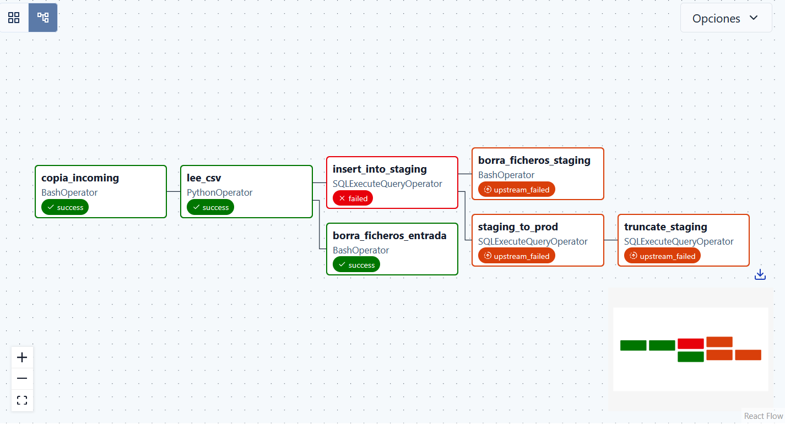

# Caso Práctico paso a paso

## ⚠️ Advertencia ⚠️
Las APIs de Pyhton de Airflow3 están cambiando.
Asegúrate de que estás usando Airflow3 y que la documentación que lees en la web (o ha leído tu LLM si haces _vibe coding_) coincide con tu versió de Airflow.

El DAG tendrá esta apariencia en el GUI de Airflow:




# Estructura del fichero

El fichero con el DAG se ha creado a partir de una plantilla _boilerplate_ de Apache Airflow3.

Tiene estas secciones:
- Imports
- Configuración del DAG
- Python callables (funciones que usaremos)
- Definición del DAG
  - Definición de Operadores que usamos.
  - Orden de ejecución de los operadores 

Vamos a verlas paso a paso:

## Imports

```python

from datetime import datetime, timedelta
from airflow import DAG
from airflow.operators.python import PythonOperator
from airflow.providers.standard.operators.bash import BashOperator

# Si buscas en la documentación de Airflow te puede aparecer este import:
# from airflow.providers.postgres.operators.postgres import PostgresOperator
# pero si lo importas, falla.
# Hay que usar este en su lugar (lo usan los tests de Airflow)
from airflow.providers.common.sql.operators.sql import SQLExecuteQueryOperator

```

Estos imports proporcionan las herramientas necesarias para crear y configurar el DAG:
- `datetime` y `timedelta` permiten trabajar con fechas y duras
- `DAG` es la clase base para definir el flujo de trabajo
- [`PythonOperator`](https://airflow.apache.org/docs/apache-airflow/stable/_api/airflow/operators/python/index.html#airflow.operators.python.PythonOperator), [`BashOperator`](https://airflow.apache.org/docs/apache-airflow/stable/_api/airflow/operators/bash/index.html#airflow.operators.bash.BashOperator) y [`SQLExecuteQueryOperator`](https://airflow.apache.org/docs/apache-airflow-providers-common-sql/stable/operators.html) permiten ejecutar tareas de Python, comandos bash y consultas SQL en bases de datos, respectivamente.

## Configuración del DAG

En Airflow quien desarrolla los dags es quien decide cuándo se ejecutan, y cómo.
En otros orquestadores es el administrador del sistema quien se encarga de esto.
```python
# ---------------------------  CONFIGURATION  --------------------------- #
# Modify these values to fit your project.
DAG_ID = "0001_Practica_ingesta"
DESCRIPTION = "Ingesta de datos en PB"
TAGS = ["inigo"]
MAX_RUNTIME_MINUTES = 10  # fail after N minutes if task still running
RETRY_ATTEMPTS = 0  # fail fast during dev, increase in prod
RETRY_DELAY_MINUTES = 2
# -------------------------------------------------------------------------- #
```


## Python callables (funciones que usaremos)

Los callables son funciones de python que pasamos como argumento a los operadores [PythonOperator](https://airflow.apache.org/docs/apache-airflow-providers-standard/stable/operators/python.html), [PythonVirtualenvOperator](airflow.apache.org/docs/apache-airflow-providers-standard/stable/operators/python.html#pythonvirtualenvoperator)

```
def procesa_fichero_a_lo_loco():
    """
    Creamos dos ficheros:
      - splitted.sql -> Contiene los cuatro primeros campos del CSV.
      - filelist     -> Lista de archivos que hemos procesado

      **IMPORTANTE** Esta función crea un fichero SQL dentro
         del directorio DAGs de Airflow !!!!

         La inserción en la BBDD necesita un SQL, o un fichero.sql
         
        ** ESTO NO ES UNA BUENA PRACTICA Y NO SE RECOMIENDA **
        Ese directorio será el resultado de un proceso CI/CD
        ¿Donde podemos poner el fichero? Si lo volcamos a un directorio
        y el operador que ejecuta el SQL se lanza en una máquina distinta
        la ETL fallará....

    """
    import glob

    # Vamos a procesar 

    with open('/home/mbit/data/out/inigo/filelist', 'w') as filelist:
        with open('/home/mbit/airflow/dags/staging.sql', 'w') as outfile: 
            for ff in glob.glob('/home/mbit/incoming/inigo/*.csv'):
                with open(ff, 'r') as fp:
                    for line in fp.readlines()[1:]:
                        campos = line.split(',')
                        output = ','.join([ f"'{x}'" for x in campos[0:4] ]) #Hay que adaptar el dato y poner comilla simple
                        insert_statement = f"INSERT INTO passengers VALUES ({output});"
                        outfile.write(f'{insert_statement}\n')
                filelist.write(f'{ff}\n')

```

En vez de utilzar un parser de CSV, o leer los ficheros con Pandas, se utilizan funciones de librería estándar.

Como queremos sólo los cuatro primeros campos del fichero CSV, los extraemos de la siguiente manera:
  - Para cada línea del fichero ejecutamos str.split(','). Esto nos develve un array con subcadenas
  - Como queremos sólo los primeros cuatro campos, utilizamos `campos[0:4]`
  - Utilizamos un list-comprehension para crear un array con que contiene entre comillas simples el contenido de cada componente del arral (campos[0:4])
  - Finalmente para volver a tener una cadena separada por comas (','), ejecutamos `','.join()
Por último estribimos esto dentro de una cadena que tiene una query sql: `INSERT INTO ... VALUES ( __resultado__ )` y lo guardamos en un fichero para que lo ejecute después un operador SQLExecuteQueryOperator.

Esto funcionará sólo si se ejecuta todo en el runner de Airflow: si nos asignan una maquina distinta para ejecutar algunas tareas del DAG, los ficheros no estarán en la máquina y fallará.

## Definición del DAG

```python
# ---------------------------  DEFAULT ARGUMENTS  ----------------------------- #
default_args = {
    "owner": "data-engineering",
    "depends_on_past": False,
    "start_date": datetime.utcnow() - timedelta(days=1),
    "email_on_failure": False,
    "email_on_retry": False,
    "retries": RETRY_ATTEMPTS,
    "retry_delay": timedelta(minutes=RETRY_DELAY_MINUTES),
    "max_active_runs": 1,  # only run one DAG run at a time
}
# -------------------------------------------------------------------------- #

# ---------------------------  DAG DEFINITION  ----------------------------- #
dag = DAG(
    DAG_ID,
    description=DESCRIPTION,
    tags=TAGS,
    default_args=default_args,
    # Automatic execution rules
    schedule="*/10 * * * *",  # cada 10 minutes
    catchup=False,  # prevent backfilling on first deploy
    max_active_runs=1,
    dagrun_timeout=timedelta(minutes=MAX_RUNTIME_MINUTES),
)
```

Lo más importante de la definición del DAG es el identificador, que debe ser único, la planificación del dag (se puede usar un formato cron, o algo más sofisticado como hacer que se ejecute cada 137 minutos usando [DeltaTriggerTimetable](https://airflow.apache.org/docs/apache-airflow/stable/authoring-and-scheduling/timetable.html#deltatriggertimetable) )

## Definición de Operadores que usamos.

```python
with dag:

    copia_ficheros_entrantes = BashOperator(
        # como queremos llamar a este 'step'
        # que queremos ejecutar
        task_id = "copia_incoming",
        bash_command = 'cp /tmp/incoming/*csv /home/mbit/incoming/inigo'
    )

    borrar_ficheros_entrantes = BashOperator(
        task_id = "borra_ficheros_entrada",
        bash_command = 'rm /tmp/incoming/*csv'
    )
    
    ...
    
```

Cada operador es un objeto que tenemos que instanciar.
Si utilizamos el dag como contexto (con el `with dag:`) no tenemos que asignar uno a uno el dag al que corresponde.

Los operadores pueden usar plantillas JINJA en vez de cadenas como aquí, que utilizamos XCOM para pasar el contenido a insertar (que no es muy grande) que habíamos calculado antes.

```
    insert_into_staging = SQLExecuteQueryOperator(
        task_id = "insert_into_staging",
        conn_id = 'staging', # Definido en la config de Airflow.
        # Para ver qué hacer la BBDD en los logs
        hook_params={"enable_log_db_messages": True},
        
        # Este es el caso de la mala paráctica sin XCOM
        # sql = "staging.sql" # SQL que hemos generado en el Python Operator

        # Hacemos pull en XCOM la clave del sql que hemos hecho push antes.
        # Necesitamos el id de la tarea que ha generado el contenido a compartir.
        # OJO! Sigue estando disponible!!!

        # Ah! y el tamaño de lo que tenemos en XCOM hay que controlarlo
        sql = "{{ ti.xcom_pull(key='sql', task_ids='lee_csv') }}"
        
    )
```

## Flujo de tareas

Si no especificamos el flujo de tareas, Airflow ejecutará linealmente una tras otra las tareas que definamos.

Si tenemos un flujo mas complejo o queremos paralelizar ejecución de tareas (siempre que tengamos runners disponibles), tenemos que definir un flujo de esta manera:

```python
# ---------------------------  TASK FLOW  ------------------------- #

    copia_ficheros_entrantes >> leer_ficheros
    leer_ficheros >> insert_into_staging
    leer_ficheros >> borrar_ficheros_entrantes
    insert_into_staging >> borrar_ficheros_staging
    insert_into_staging >> insert_into_prod
    insert_into_prod >> truncate_staging

# ----------------------------------------------------------------------- #
```

Hay que tener cuidado cuando borramos datos con estas dos cosas:
- Condiciones de carrera
- Tener que volver a ir al transaccional a cargar datos sin necesidad.

Una condición de carrera se da cuando una operación depende del momento en que se ejecuta y puede producir resultados incorrectos si otros procesos modifican el estado entre la comprobación y la acción.

Por ejemplo, si usamos `rm *.csv` para borrar los ficheros que ya hemos procesado, pero mientras tanto siguen llegando nuevos ficheros al directorio, podemos acabar borrando ficheros que aún no hemos procesado, ya que el comando borrará todos los archivos CSV existentes en ese momento sin distinguir entre los procesados y los nuevos.

También puede ocurrir que borremos los ficheros "demasiado pronto" y en caso de que nuestro proceso falle total o parcialmente tengamos que volver al transaccional a descargar toda la información de nuevo en vez de descargar únicamente los últimos datos que necesitamos. 

Tenemos que tener en cuenta que no siempre podremos acceder a los datos del transaccional de nuevo, o que podemos tener una ventana temporal de acceso a esos sistemas que no podemos sobrepasar.
