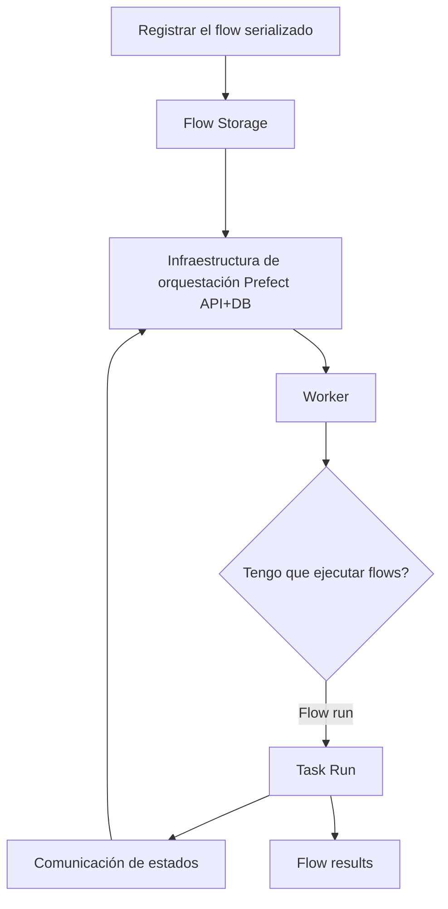

# Prefect Cloud 

## Flujo de ejecución

El flujo de ejecución sigue estos pasos:

**Descripción del flujo:**

1. El flow se registra (serializado) y se almacena en el **Storage**.
2. El **Worker** consulta periódicamente a la Prefect API si hay flows pendientes de ejecutar.
3. La API responde con el path al flujo y los resultados se devuelven al storage.
4. Las tareas (**Task Runs**) comunican sus estados de vuelta a la Prefect API.

### Prefect Cloud — Deployments

Un **Deployment** añade metadatos y configuración a un flow para su correcta ejecución y orquestación:

| Dimensión | Descripción |
|---|---|
| **Dónde** | Especifica la infraestructura donde se ejecutará el flow |
| **Cuándo** | Permite definir un *scheduler* o triggers basados en eventos |
| **Cómo** | Indica a qué *work pool* se envía el flow y, por tanto, qué workers pueden ejecutarlo |
| **Storage** | Lugar donde se almacena el flow serializado (código fuente) para que los workers puedan recuperarlo y ejecutarlo |
